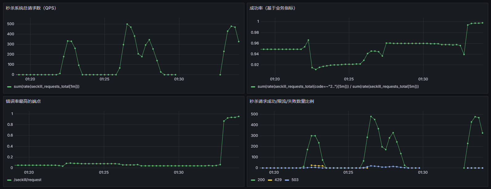
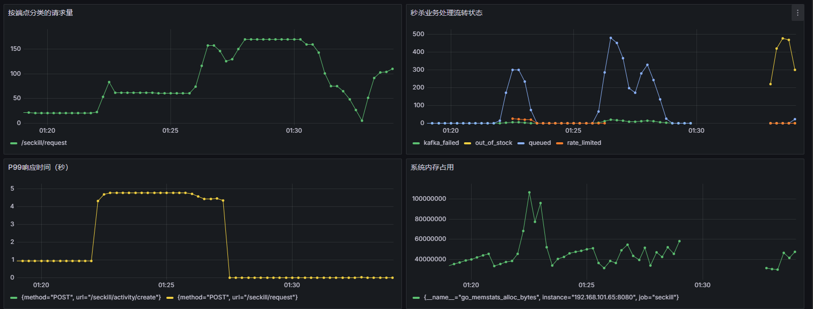
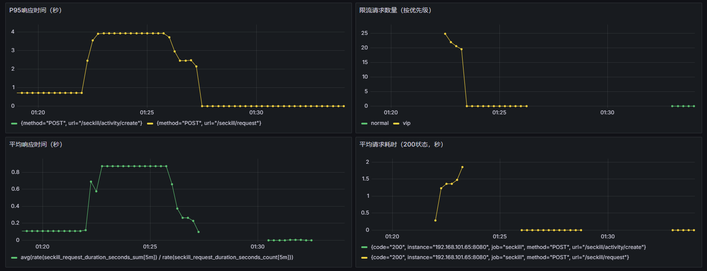
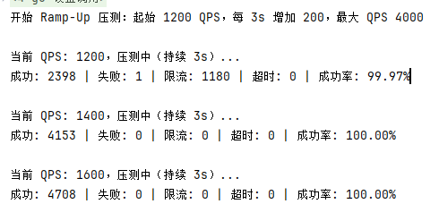

# 秒杀滴答

## 实现功能
- 前置校验：开始时间、结束时间、库存是否有多等
- 限流策略：VIP进入Sentinel，非VIP进入Redis令牌桶限流
- Kafka消息队列：通过Kafka发送到消息队列，异步处理订单创建
- 库存安全：Lua脚本封装库存校验、库存预扣减与Token下发逻辑，防止库存超卖，支持一人一单校验，提升系统稳定性。
- 库存回滚：基于 Asynq 构建统一定时分布式任务轮询器，完成过期令牌库存回滚，替代单用户延时任务方案，大幅节省资源。

## 安装
启动docker
```bash
systemctl start docker
```
在docker里面运行如下命令构建容器
```bash
docker-compose up -d
# 检验是否完全启动成功
docker ps
# 如果需要查看日志可以使用
docker-compose logs -f
```
PS: 如果有错误，可以先手动docker pull对应镜像再执行上面的命令。

需要停止可以使用
```bash
docker-compose down
```

- Grafana监控在project-init/Grafana下
- mysql建表语句在project-init/Mysql下
- consul配置新建不同环境的key-value，文件在project-init/Consul下
  - config/dev/seckill_limits
  - config/online/seckill_limits
  - config/test/seckill_limits

安装完成后使用如下命令启动
```bash
go run .
```

服务器如果需要同步时间（普罗米修斯需要时间对齐）
```bash
yum install -y chrony
# 启动并设置开机自启
sudo systemctl start chronyd
sudo systemctl enable chronyd
# 查看同步状态
chronyc tracking
# 强制立即同步（可选）
sudo chronyc makestep
# 验证当前时间和同步源
timedatectl
```

安装node_exporter(可选，查看服务器资源使用情况)
```bash
# 切换到 /opt 或其他合适目录
cd /opt

wget https://github.com/prometheus/node_exporter/releases/download/v1.9.1/node_exporter-1.9.1.linux-amd64.tar.gz
tar -xzf node_exporter-1.9.1.linux-amd64.tar.gz
cd node_exporter-1.9.1.linux-amd64
```

### 不同界面位置
- kafka-ui: http://192.168.101.65:8084
- consul: http://192.168.101.65:8500
- reids: http://192.168.101.65:6379
- mysql: http://192.168.101.65:3306
- asynq: http://192.168.101.65:8085
- Prometheus: http://192.168.101.65:9090
- Grafana: http://192.168.101.65:3000 （默认账号 admin/admin）

### 监控配置





